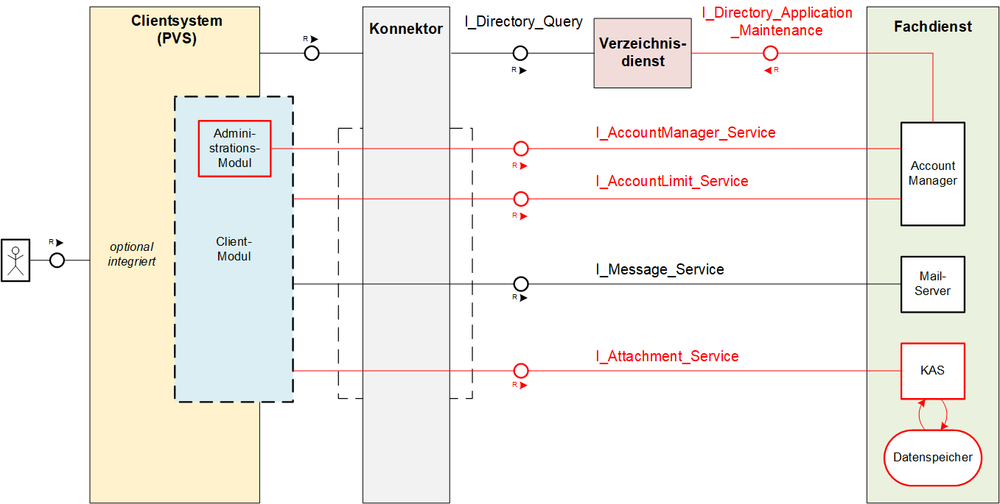

# KIM (Kommunikation im Medizinwesen) - API-Dokumentation

## Allgemeines

Die folgende Dokumentation beschreibt die systemspezifische Lösung von KOM-LE 1.5. Es werden insbesondere die Komponenten der Lösung sowie deren Schnittstellen dargestellt und erläutert. Die Version KOM-LE 1.5 ist vollständig abwärtskompatibel. Dadurch wird gewährleistet, dass Teilnehmer einer früheren Version uneingeschränkt Nachrichten an Teilnehmern mit KOM-LE 1.5 versenden können.

Der Funktionsumfang für KOM-LE 1.5 erweitert sich um,

-   ✓ Aufhebung der Größenbeschränkung von Nachrichten

-   ✓ Optionale Integration des Clientmoduls in das PVS

-   ✓ Administrationsmodul für die Konfiguration

-   ✓ Unterstützung syntaktischer Nachrichtenkategorien

Die Einordnung von KOM-LE 1.5 für das Release 4.0.0 liefert das Systemdesign der Telematikinfrastruktur - Release 4.0.0 - [gemKPT_SysD_TI].

_Hinweis: Seit März 2020 verwendet die gematik die Bezeichnung „KIM – Kommunikation im Medizinwesen“ für die Anwendung KOM-LE. Diese neue Benennung findet sich insbesondere in Informationsmaterialien für die Zielgruppe Leistungserbringer sowie in Presseveröffentlichungen. Eine Umbenennung in den technisch-normativen Dokumenten wie Spezifikationen, Konzepten, Zulassungsdokumenten etc. mit Ausnahme von Angaben zu Domänen, E-Mail-Adressen, technischen Schnittstellen, Parametern u.ä. ist mit Stand Release 4.0.0 nicht geplant._

## Systemarchitektur

Die folgende Abbildung gibt einen Überblick über die Systemarchitektur von KOM-LE 1.5

[**Clientsystem**](docs/KIM_API.adoc)

-   **Clientmodul:**  
    Das Clientmodul kann jetzt optional in das Clientsystem integriert werden.

-   **Administrationsmodul:**  
    Die Erweiterung des Clientmoduls um das Administrationsmodul ermöglicht die Kommunikation mit dem Account Manager des Fachdienstes. Dadurch wird der Leistungserbringer in die Lage versetzt, sich beim Fachdienst zu registrieren, seinen Registrierungsstatus abzufragen oder eine Deregistrierung vorzunehmen. Zugleich kann über das Administrationsmodul das benötigte Clientzertifikat (PKCS\#12) heruntergeladen werden.

[**Fachdienst**](docs/Fachdienst.adoc)

-   **Account Manager:**  
    Für die einfache Verwaltung des Accounts eines KOM-LE-Teilnehmers wird der Account Manager um einen Webservice erweitert.

-   **KOM-LE Attachment Service:**  
    Der Fachdienst wird um die Komponente KAS (KOM-LE Attachment Services) ergänzt, der die sichere Speicherung größerer Anhänge erlaubt.

[**Basisdienste**](docs/Basisdienste.adoc)

-   **Verzeichnisdienst:**  
    Um die Kompatibilität von KOM-LE 1.5 zu früheren Versionen zu gewährleisten, wird der Verzeichnisdienst mit einem neuen Attribut (*KOM-LE-Version*) erweitert.

## Ordnerstruktur

Im Folgenden ist die Organisation der Ordnerstruktur dargestellt.

    KIM-API
    ├─ docs
    ├─ images
    ├─ samples
    │   ├──── KAS
    │   │    └── MultipleAttachments.zip
    │   └──── SMIME-Profil.zip
    ├─ src
    │   ├──── openapi
    │   │    ├── AccountManager.yaml
    │   │    └── AttachmentServices.yaml
    │   └──── schema
    │        └── Attachment_schema.json
    ├── README.md
    └── ReleaseNotes.md

## Weiterführende Seiten

[- Anwendungsfälle](docs/Anwendungsfaelle.adoc)  

**Produkttypen**  
[- Clientsystem](docs/KIM_API.adoc)  
[- Fachdienst](docs/Fachdienst.adoc)  

**Leitfaden für Primärsystemhersteller**  
[- Primärsystem](docs/Primaersystem.adoc)  

**Diverses**  
[- Basisdienste](docs/Basisdienste.adoc)  
[- Versionierung](docs/Versionierung.adoc)  

## Lizenzbedingungen
Copyright (c) 2020 gematik GmbH

Licensed under the Apache License, Version 2.0 (the "License");
you may not use this file except in compliance with the License.
You may obtain a copy of the License at

http://www.apache.org/licenses/LICENSE-2.0

Unless required by applicable law or agreed to in writing, software
distributed under the License is distributed on an "AS IS" BASIS,
WITHOUT WARRANTIES OR CONDITIONS OF ANY KIND, either express or implied.
See the License for the specific language governing permissions and
limitations under the License. 
